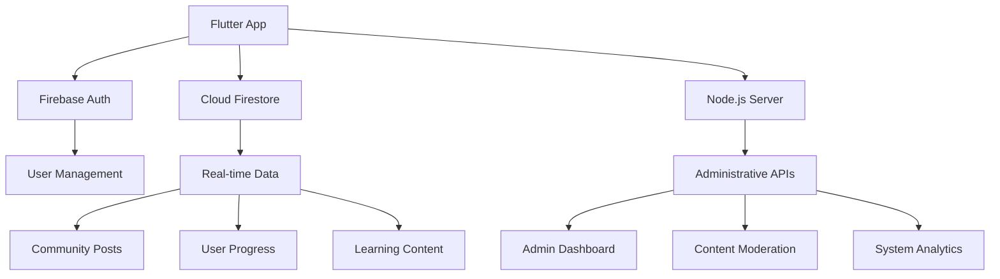

# MIL Hub - Media Information Literacy Hub

[](https://flutter.dev/)
[](https://dart.dev/)
[](https://firebase.google.com/)
[](#)

A comprehensive media literacy education and fact-checking platform designed specifically for youth. MIL Hub empowers young users to identify misinformation, verify digital content, and develop critical thinking skills in the digital age.

## 🌟 Features

### 🔐 Authentication System
- **Email Authentication**: Secure email/password login and registration
- **Google Sign-In**: Quick authentication with Google accounts
- **Session Management**: Persistent login sessions with Firebase Auth
- **User Profile Management**: Comprehensive user profiles and settings
- **Clean Architecture Implementation**: Domain, Data, and Presentation layers with BLoC state management
- **Advanced Error Handling**: Structured exception and failure patterns across layers

### 📚 Learn Module
- **Interactive Lessons**: Structured media literacy education content
- **Quiz System**: Comprehension testing with immediate feedback
- **Gamification**: Achievements, badges, and progress tracking
- **Offline Learning**: Access content without internet connectivity
- **Personalized Dashboard**: Adaptive learning paths based on progress
- **Streak Tracking**: Daily learning streaks to encourage consistency
- **Leaderboards**: Community-driven competitive learning
- **Clean Architecture Implementation**: Full Clean Architecture with domain entities, use cases, data models, and BLoC pattern
- **Progress Tracking**: Real-time lesson completion and user progress monitoring

### 🔍 Instant Check Feature
- **Link Verification**: Real-time analysis of URLs and news content
- **Content Authenticity**: Advanced algorithms to detect misinformation
- **Share-to-Verify**: Integration with device sharing functionality
- **Clipboard Monitoring**: Privacy-aware background monitoring for suspicious links
- **Security Alerts**: Proactive warnings about potentially harmful content
- **Image Verification**: Reverse image search capabilities for authenticity checking
- **Comprehensive Analysis**: Protocol security, keyword detection, reachability, fact-checking, and news credibility
- **Clean Architecture Implementation**: Modular design with repository pattern and use cases

### 👥 Community Module
- **Social Feed**: Real-time community posts and discussions
- **Comment System**: Threaded conversations on posts
- **User Interactions**: Like, share, and engage with community content
- **Knowledge Sharing**: Collaborative fact-checking and verification
- **Elegant UI**: Sophisticated animations and micro-interactions
- **User Statistics**: Track community engagement and contributions
- **Admin Moderation**: Content moderation and user management capabilities
- **Clean Architecture Implementation**: Full feature separation with proper state management

### 🛠️ Administrative Features
- **User Management**: Admin dashboard for user account oversight
- **Content Moderation**: Tools for monitoring and managing community content
- **System Analytics**: Comprehensive metrics and usage statistics
- **Activity Logging**: Detailed audit trails for administrative actions
- **Role-Based Access**: Secure admin access with proper authorization
- **Real-time Monitoring**: Live dashboard with system health indicators
- **Reports Generation**: Automated reporting on user activities and system performance
- **User Permissions Management**: Fine-grained control over user roles and capabilities

### 📊 Dashboard & Analytics
- **User Progress**: Comprehensive learning progress tracking
- **Statistics Overview**: Personal and community engagement metrics
- **Achievement Gallery**: Visual representation of earned badges and milestones
- **Settings Management**: Customizable app preferences and privacy controls
- **Quick Navigation**: Direct access to all major app features
- **Admin Access**: Role-based administrative dashboard integration
- **Enhanced Visualization**: Improved charts and graphs for better data interpretation

## 🏗️ Architecture

### Technology Stack
- **Frontend**: Flutter (Dart 3.9.0) with Material Design 3
- **Backend**: Firebase (Authentication, Firestore, Cloud Storage)
- **Administrative Server**: Node.js with Express
- **State Management**: Flutter BLoC Pattern
- **Dependency Injection**: GetIt Service Locator
- **Architecture Pattern**: Clean Architecture with Feature-based Modular Design
- **Error Handling**: Structured Exception/Failure Pattern (Exceptions in Data Layer, Failures in Domain Layer)

### Project Structure
```
lib/
├── core/                    # Core infrastructure and shared utilities
│   ├── constants/           # Application-wide constants
│   ├── di/                  # Dependency injection setup
│   ├── error/               # Error handling patterns
│   ├── errors/              # Exception and failure definitions
│   ├── network/             # Network layer abstractions
│   ├── theme/               # App-wide theming and styling
│   ├── utils/               # Utility functions and helpers
│   └── widgets/             # Reusable UI components
├── features/                # Feature modules (Clean Architecture)
│   ├── auth/               # Authentication system
│   │   ├── data/           # Data layer (models, datasources, repositories)
│   │   ├── di/             # Feature-specific dependency injection
│   │   ├── domain/         # Domain layer (entities, use cases, repositories)
│   │   ├── presentation/   # Presentation layer (BLoC, screens, widgets)
│   │   └── screens/        # UI screens
│   ├── check/              # Link and content verification
│   │   ├── data/           # Data layer implementation
│   │   ├── di/             # Dependency injection
│   │   ├── domain/         # Domain logic and entities
│   │   ├── presentation/   # UI and state management
│   │   └── screens/        # Verification screens
│   ├── community/          # Social features
│   │   ├── data/           # Data implementations
│   │   ├── di/             # Feature injection
│   │   ├── domain/         # Community entities and logic
│   │   ├── presentation/   # Presentation layer
│   │   └── screens/        # Community UI
│   ├── learn/              # Educational content
│   │   ├── data/           # Lesson data management
│   │   ├── di/             # Learn feature injection
│   │   ├── domain/         # Learning entities and use cases
│   │   ├── presentation/   # Learning UI and state
│   │   └── screens/        # Educational screens
│   ├── admin/              # Administrative features
│   │   ├── models/         # Admin data models
│   │   ├── screens/        # Admin UI screens
│   │   ├── services/       # Admin services
│   │   └── widgets/        # Admin UI components
│   └── users/              # User profile and dashboard
│       ├── dashboard/      # User dashboard implementation
│       ├── data/           # User data models and services
│       ├── di/             # User feature injection
│       ├── domain/         # User entities and use cases
│       └── presentation/   # User UI and state management
├── common/                  # Shared components
│   └── widgets/             # Common UI widgets
├── screens/                 # Top-level application screens
├── services/                # Global services
└── widgets/                 # Application widgets
```

### Clean Architecture Implementation
Each feature follows the Clean Architecture pattern with clear separation of concerns:

1. **Domain Layer**: Contains business logic, entities, and repository interfaces
2. **Data Layer**: Implements data sources, models, and repository implementations
3. **Presentation Layer**: Handles UI, state management (BLoC), and user interactions
4. **Dependency Injection**: Manages service registration and retrieval

#### Domain Layer
Contains the core business logic and entities that represent the problem domain:
- Entities: Core data structures with business rules
- Use Cases: Application-specific business logic
- Repositories: Abstract contracts for data access

#### Data Layer
Implements the data access mechanisms:
- Models: Data transfer objects that map to/from entities
- Data Sources: Concrete implementations for local/remote data access
- Repositories: Implementations of domain repository contracts

#### Presentation Layer
Handles UI rendering and user interaction:
- BLoC/Cubit: State management for reactive UI updates
- Screens: Top-level UI components
- Widgets: Reusable UI components for the feature

### Data Flow


## 🚀 Getting Started

### Prerequisites
- [Flutter SDK](https://flutter.dev/docs/get-started/install) (3.35.1 or higher)
- [Dart SDK](https://dart.dev/get-dart) (3.9.0 or higher)
- [Android Studio](https://developer.android.com/studio) or [VS Code](https://code.visualstudio.com/)
- [Firebase CLI](https://firebase.google.com/docs/cli) for backend configuration
- [Node.js](https://nodejs.org/) (for the administrative server)

### Installation

1. **Clone the repository**
   ```bash
   git clone <repository-url>
   cd mil_hub
   ```

2. **Install Flutter dependencies**
   ```bash
   flutter pub get
   ```

3. **Set up Firebase**
   - Create a new Firebase project at [Firebase Console](https://console.firebase.google.com/)
   - Enable Authentication and Firestore
   - Download `google-services.json` and place it in `android/app/`
   - Configure Firebase options in `lib/firebase_options.dart`

4. **Configure the Node.js server**
   ```bash
   cd server
   npm install
   # Add your Firebase service account key as serviceAccountKey.json
   npm start
   ```

5. **Run the application**
   ```bash
   flutter run
   ```

### Firebase Configuration

Ensure your Firebase project has the following services enabled:
- **Authentication**: Email/Password and Google Sign-In
- **Cloud Firestore**: For storing user data, posts, and progress
- **Cloud Storage**: For user-generated content (if applicable)

## 📱 Core Dependencies

### Main Dependencies
- `firebase_core: ^4.0.0` - Firebase initialization
- `firebase_auth: ^6.1.0` - Authentication services
- `cloud_firestore: ^6.0.0` - NoSQL database
- `google_sign_in: ^6.2.1` - Google authentication
- `share_plus: ^12.0.0` - Device sharing functionality
- `url_launcher: ^6.2.1` - External URL handling
- `http: ^1.1.0` - HTTP client for API calls
- `dio: ^5.3.2` - Advanced HTTP client
- `image_picker: ^1.0.4` - Image selection functionality
- `crypto: ^3.0.3` - Cryptographic operations
- `flutter_bloc: ^8.1.1` - State management with BLoC pattern
- `get_it: ^7.6.0` - Dependency injection service locator
- `equatable: ^2.0.5` - Value equality comparisons
- `fpdart: ^1.1.0` - Functional programming utilities
- `intl: ^0.19.0` - Internationalization and formatting

### Development Dependencies
- `flutter_test` - Testing framework
- `flutter_lints: ^5.0.0` - Code quality and style
- `flutter_launcher_icons: ^0.14.4` - App icon generation

## 🔧 Development

### Running Tests
```bash
flutter test
```

### Code Analysis
```bash
flutter analyze
```

### Building for Release
```bash
# Android
flutter build apk --release

# iOS
flutter build ios --release
```

## 🛡️ Security Features

- **Privacy-Aware Clipboard Monitoring**: Checks clipboard only when app resumes
- **Secure Authentication**: Firebase Auth with proper session management
- **Data Validation**: Input sanitization and validation
- **Firestore Security Rules**: Backend data access control
- **Content Verification**: Real-time link and content authenticity checking
- **Role-Based Access Control**: Admin features secured with proper authorization
- **Secure Data Transmission**: HTTPS encryption for all network communications
- **Input Sanitization**: Protection against injection attacks and malicious content

## 🎨 UI/UX Design

- **Material Design 3**: Latest Material Design guidelines implementation
- **Sophisticated Animations**: Micro-interactions and smooth transitions
- **Responsive Layout**: Adapts to different screen sizes
- **Accessibility**: Support for screen readers and assistive technologies
- **Dark Mode**: Automatic theme switching based on system preferences
- **Consistent Theming**: Unified color scheme and typography across features
- **Intuitive Navigation**: User-friendly interface with clear pathways
- **Visual Feedback**: Immediate response to user actions

## 📖 User Journey

1. **Onboarding**: Landing page with app introduction
2. **Authentication**: Login or register with email/Google
3. **Dashboard**: Personalized overview of progress and activities
4. **Learning**: Browse lessons, take quizzes, track progress
5. **Verification**: Check links and content for authenticity
6. **Community**: Engage with other users, share knowledge
7. **Profile**: Manage settings, view achievements, track statistics
8. **Admin**: (For authorized users) Access administrative features and system monitoring

## 🤝 Contributing

This is a private project. For development team members:

1. Follow the established Clean Architecture patterns
2. Write tests for new features
3. Update documentation for any changes
4. Ensure Firebase security rules are properly configured
5. Test on both Android and iOS platforms
6. Maintain consistent code style and naming conventions
7. Use the established dependency injection patterns
8. Follow the structured error handling approach

## 📄 License

This project is private and not intended for public distribution.

## 📞 Support

For technical support or questions about the MIL Hub application, please contact the development team.

---

**Built with ❤️ for digital literacy education**