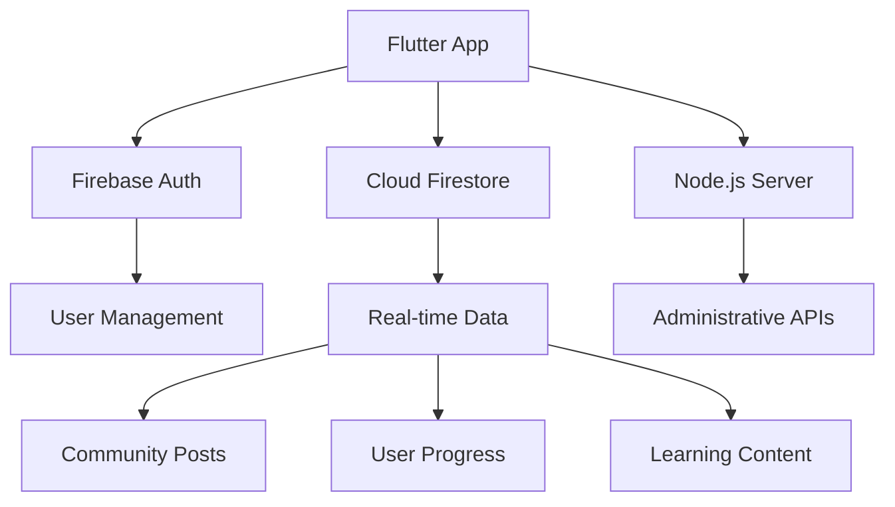

# MIL Hub - Media Information Literacy Hub

[](https://flutter.dev/)
[](https://dart.dev/)
[](https://firebase.google.com/)
[](#)

A comprehensive media literacy education and fact-checking platform designed specifically for youth. MIL Hub empowers young users to identify misinformation, verify digital content, and develop critical thinking skills in the digital age.

## 🌟 Features

### 🔐 Authentication System
- **Email Authentication**: Secure email/password login and registration
- **Google Sign-In**: Quick authentication with Google accounts
- **Session Management**: Persistent login sessions with Firebase Auth
- **User Profile Management**: Comprehensive user profiles and settings

### 📚 Learn Module
- **Interactive Lessons**: Structured media literacy education content
- **Quiz System**: Comprehension testing with immediate feedback
- **Gamification**: Achievements, badges, and progress tracking
- **Offline Learning**: Access content without internet connectivity
- **Personalized Dashboard**: Adaptive learning paths based on progress
- **Streak Tracking**: Daily learning streaks to encourage consistency
- **Leaderboards**: Community-driven competitive learning

### 🔍 Instant Check Feature
- **Link Verification**: Real-time analysis of URLs and news content
- **Content Authenticity**: Advanced algorithms to detect misinformation
- **Share-to-Verify**: Integration with device sharing functionality
- **Clipboard Monitoring**: Privacy-aware background monitoring for suspicious links
- **Security Alerts**: Proactive warnings about potentially harmful content

### 👥 Community Module
- **Social Feed**: Real-time community posts and discussions
- **Comment System**: Threaded conversations on posts
- **User Interactions**: Like, share, and engage with community content
- **Knowledge Sharing**: Collaborative fact-checking and verification
- **Elegant UI**: Sophisticated animations and micro-interactions
- **User Statistics**: Track community engagement and contributions

### 📊 Dashboard & Analytics
- **User Progress**: Comprehensive learning progress tracking
- **Statistics Overview**: Personal and community engagement metrics
- **Achievement Gallery**: Visual representation of earned badges and milestones
- **Settings Management**: Customizable app preferences and privacy controls

## 🏗️ Architecture

### Technology Stack
- **Frontend**: Flutter (Dart)
- **Backend**: Firebase (Authentication, Firestore, Cloud Storage)
- **Administrative Server**: Node.js with Express
- **State Management**: Built-in Flutter state management
- **Architecture Pattern**: Feature-first modular architecture

### Project Structure
```
lib/
├── features/
│   ├── auth/           # Authentication screens and services
│   ├── check/          # Link verification and security features
│   ├── community/      # Social features and interactions
│   ├── learn/          # Educational content and quizzes
│   └── users/          # User profiles and dashboard
├── common/
│   └── widgets/        # Reusable UI components
├── constants/          # App-wide constants
├── services/           # Global services (clipboard, sharing)
└── screens/            # Top-level screens
```

### Data Flow


## 🚀 Getting Started

### Prerequisites
- [Flutter SDK](https://flutter.dev/docs/get-started/install) (3.35.1 or higher)
- [Dart SDK](https://dart.dev/get-dart) (3.9.0 or higher)
- [Android Studio](https://developer.android.com/studio) or [VS Code](https://code.visualstudio.com/)
- [Firebase CLI](https://firebase.google.com/docs/cli) for backend configuration
- [Node.js](https://nodejs.org/) (for the administrative server)

### Installation

1. **Clone the repository**
   ```bash
   git clone <repository-url>
   cd mil_hub
   ```

2. **Install Flutter dependencies**
   ```bash
   flutter pub get
   ```

3. **Set up Firebase**
   - Create a new Firebase project at [Firebase Console](https://console.firebase.google.com/)
   - Enable Authentication and Firestore
   - Download `google-services.json` and place it in `android/app/`
   - Configure Firebase options in `lib/firebase_options.dart`

4. **Configure the Node.js server**
   ```bash
   cd server
   npm install
   # Add your Firebase service account key as serviceAccountKey.json
   npm start
   ```

5. **Run the application**
   ```bash
   flutter run
   ```

### Firebase Configuration

Ensure your Firebase project has the following services enabled:
- **Authentication**: Email/Password and Google Sign-In
- **Cloud Firestore**: For storing user data, posts, and progress
- **Cloud Storage**: For user-generated content (if applicable)

## 📱 Core Dependencies

### Main Dependencies
- `firebase_core: ^4.0.0` - Firebase initialization
- `firebase_auth: ^6.1.0` - Authentication services
- `cloud_firestore: ^6.0.0` - NoSQL database
- `google_sign_in: ^6.2.1` - Google authentication
- `share_plus: ^12.0.0` - Device sharing functionality
- `url_launcher: ^6.2.1` - External URL handling
- `http: ^1.1.0` - HTTP client for API calls
- `dio: ^5.3.2` - Advanced HTTP client
- `image_picker: ^1.0.4` - Image selection functionality
- `crypto: ^3.0.3` - Cryptographic operations

### Development Dependencies
- `flutter_test` - Testing framework
- `flutter_lints: ^5.0.0` - Code quality and style
- `flutter_launcher_icons: ^0.14.4` - App icon generation

## 🔧 Development

### Running Tests
```bash
flutter test
```

### Code Analysis
```bash
flutter analyze
```

### Building for Release
```bash
# Android
flutter build apk --release

# iOS
flutter build ios --release
```

## 🛡️ Security Features

- **Privacy-Aware Clipboard Monitoring**: Checks clipboard only when app resumes
- **Secure Authentication**: Firebase Auth with proper session management
- **Data Validation**: Input sanitization and validation
- **Firestore Security Rules**: Backend data access control
- **Content Verification**: Real-time link and content authenticity checking

## 🎨 UI/UX Design

- **Material Design**: Consistent with Android design guidelines
- **Sophisticated Animations**: Micro-interactions and smooth transitions
- **Responsive Layout**: Adapts to different screen sizes
- **Accessibility**: Support for screen readers and assistive technologies
- **Dark Mode**: Automatic theme switching based on system preferences

## 📖 User Journey

1. **Onboarding**: Landing page with app introduction
2. **Authentication**: Login or register with email/Google
3. **Dashboard**: Personalized overview of progress and activities
4. **Learning**: Browse lessons, take quizzes, track progress
5. **Verification**: Check links and content for authenticity
6. **Community**: Engage with other users, share knowledge
7. **Profile**: Manage settings, view achievements, track statistics

## 🤝 Contributing

This is a private project. For development team members:

1. Follow the established code style and architecture patterns
2. Write tests for new features
3. Update documentation for any changes
4. Ensure Firebase security rules are properly configured
5. Test on both Android and iOS platforms

## 📄 License

This project is private and not intended for public distribution.

## 📞 Support

For technical support or questions about the MIL Hub application, please contact the development team.

---

**Built with ❤️ for digital literacy education**
