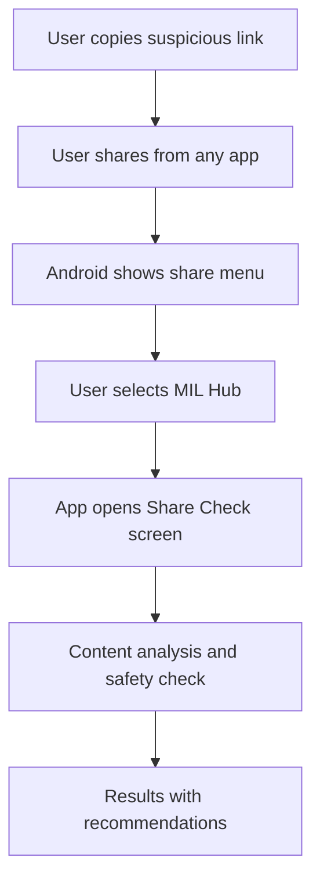

# Share-to-Verify Feature Implementation

## Overview
The Share-to-Verify feature allows users to share suspicious links and content directly from any app (browsers, social media, messaging apps) to MIL Hub for instant security analysis. This creates a seamless workflow where users can quickly verify potentially dangerous content without manually copying and pasting.

## ✅ **COMPLETED IMPLEMENTATION**

### 🔧 **Core Components**

#### 1. **ShareIntentService** (`lib/services/share_intent_service.dart`)
- **Purpose**: Handles incoming shared content and navigation
- **Key Methods**:
  - `initialize()`: Sets up the service with navigator key
  - `navigateToShareCheck()`: Routes to dedicated share check screen
  - `extractUrls()`: Detects URLs in shared text
  - `cleanUrl()`: Sanitizes and validates URLs

#### 2. **ShareCheckScreen** (`lib/screens/share_check_screen.dart`)
- **Purpose**: Dedicated UI for analyzing shared content
- **Features**:
  - Animated entrance with pulse effects
  - Content preview with syntax highlighting
  - Multiple URL selection (when multiple links detected)
  - Integrated analysis using existing `LinkCheckService`
  - Real-time progress indicators
  - Comprehensive results display

#### 3. **Android Manifest Configuration** (`android/app/src/main/AndroidManifest.xml`)
- **Intent Filters Added**:
  - `android.intent.action.SEND` for single text sharing
  - `android.intent.action.SEND_MULTIPLE` for multiple items
  - MIME types: `text/plain` and `text/*`

### 🎨 **User Experience Flow**



#### **Step-by-Step User Journey**:

1. **Content Discovery**: User encounters suspicious link in TikTok, Instagram, WhatsApp, etc.
2. **Share Action**: User taps share button in the source app
3. **App Selection**: Android presents share menu with MIL Hub as option
4. **Instant Analysis**: App opens directly to Share Check screen
5. **Automated Processing**: Content is analyzed using existing link checking infrastructure
6. **Results Display**: User receives comprehensive safety assessment

### 📱 **Supported Share Sources**

#### **Social Media Apps**:
- TikTok (links in bio, comments)
- Instagram (story links, DM links)
- Twitter/X (tweet links, DM content)
- Facebook (post links, messenger content)
- YouTube (video links, comment links)

#### **Messaging Apps**:
- WhatsApp (chat links, forwarded messages)
- Telegram (channel links, chat content)
- Discord (shared links, message content)
- SMS/Text Messages (suspicious links)

#### **Browsers**:
- Chrome (share current page or selected text)
- Firefox (share links or text selections)
- Safari (iOS - when available)
- Edge (share functionality)

#### **Email Apps**:
- Gmail (suspicious email content)
- Outlook (shared links)
- Any email app with share functionality

### 🛡️ **Security Features**

#### **Content Analysis**:
- **URL Detection**: Advanced regex pattern matching
- **Multiple Link Handling**: Smart selection when multiple URLs detected
- **Content Sanitization**: Removes common share prefixes and formatting
- **Protocol Validation**: Automatic HTTPS preference

#### **Integration with Existing Security**:
- **LinkCheckService**: Full analysis using established infrastructure
- **Suspicious Keyword Detection**: 25+ scam indicators
- **Community Transparency**: Results saved to Firestore
- **HTTPS/Protocol Verification**: Security assessment

### 🎯 **Technical Implementation Details**

#### **Dependencies Added**:
```yaml
dependencies:
  receive_sharing_intent: ^1.6.2  # Share intent handling
```

#### **Android Manifest Configuration**:
```xml
<!-- Share Intent Filter for Text -->
<intent-filter>
    <action android:name="android.intent.action.SEND" />
    <category android:name="android.intent.category.DEFAULT" />
    <data android:mimeType="text/plain" />
</intent-filter>

<!-- Share Intent Filter for URLs -->
<intent-filter>
    <action android:name="android.intent.action.SEND" />
    <category android:name="android.intent.category.DEFAULT" />
    <data android:mimeType="text/*" />
</intent-filter>
```

#### **Navigation Integration**:
```dart
routes: {
  "/share-check": (_) => const ShareCheckScreen(),
}
```

### 🎨 **User Interface Design**

#### **Share Check Screen Features**:
- **Animated Header**: Pulsing security icon with gradient background
- **Content Preview**: Syntax-highlighted display of shared content
- **URL Selection**: Radio buttons for multiple detected links
- **Action Buttons**: Copy content, analyze safety
- **Results Section**: Color-coded safety assessment
- **Security Tips**: Educational content about safe browsing

#### **Visual Feedback**:
- **Loading States**: Progress indicators during analysis
- **Haptic Feedback**: Touch responses for better UX
- **Color Coding**: Green (safe), Orange (suspicious), Red (dangerous)
- **Smooth Animations**: Fade and slide transitions

### 📊 **Performance Optimizations**

#### **Efficient Processing**:
- **Lazy Loading**: Content analyzed only when requested
- **Smart Caching**: Duplicate link detection to avoid redundant checks
- **Background Processing**: Non-blocking UI updates
- **Error Resilience**: Graceful handling of malformed content

#### **Memory Management**:
- **Stream Cleanup**: Proper disposal of intent listeners
- **Navigator Management**: Global key for reliable navigation
- **State Management**: Efficient widget lifecycle handling

## 🧪 **Testing Instructions**

### **Manual Testing Steps**:

#### **Test 1: Browser Share**
1. Open any browser (Chrome, Firefox)
2. Navigate to a website with a suspicious URL
3. Tap share button → Select MIL Hub
4. Verify Share Check screen opens with URL
5. Test analysis functionality

#### **Test 2: Social Media Share**
1. Open TikTok/Instagram
2. Find a post with a link in bio or comments
3. Copy link and share → Select MIL Hub
4. Verify content detection and analysis

#### **Test 3: Messaging App Share**
1. Receive suspicious link in WhatsApp/Telegram
2. Long-press message → Share → MIL Hub
3. Verify proper content extraction and analysis

#### **Test 4: Multiple URLs**
1. Share text containing multiple links
2. Verify radio button selection interface
3. Test analysis of selected URL

### **Edge Case Testing**:
- Empty share content
- Very long URLs (>2048 characters)
- Malformed URLs
- Network connectivity issues
- App not authenticated

## 🔮 **Future Enhancements**

### **Advanced Share Features**:
- **QR Code Analysis**: Extract URLs from shared images
- **Document Processing**: Analyze links in PDF/DOC files
- **Batch Processing**: Handle multiple shared items
- **Smart Notifications**: Background processing with results

### **Enhanced Security**:
- **Real-time Threat Intelligence**: Integration with security feeds
- **AI Content Analysis**: Machine learning for content assessment
- **Community Reporting**: User feedback on false positives
- **Custom Blacklists**: User-defined dangerous domains

### **Platform Expansion**:
- **iOS Share Extensions**: Native iOS sharing support
- **Web Share API**: Browser extension compatibility
- **Desktop Integration**: Windows/macOS share menu support

## 📋 **Known Limitations**

### **Current Constraints**:
1. **Android Only**: iOS implementation requires separate share extension
2. **Text Content**: Limited to text-based sharing (no image analysis yet)
3. **App State**: Requires app to be properly initialized for navigation
4. **Network Dependency**: Analysis requires internet connectivity

### **Workarounds**:
- Manual clipboard checking for iOS users
- Progressive enhancement for offline scenarios
- Fallback to main check screen if share screen fails

## 🎯 **Success Metrics**

### **User Adoption**:
- Share-to-verify usage frequency
- Time from share to analysis completion
- User retention after using share feature

### **Security Impact**:
- Number of malicious links detected via sharing
- Reduction in user clicks on dangerous content
- Community contribution to threat database

## 📝 **Technical Notes**

### **Development Decisions**:
- **Plugin Choice**: `receive_sharing_intent` for maximum compatibility
- **Navigation Strategy**: Global navigator key for reliable routing
- **State Management**: Stateful widgets for complex share screen interactions
- **Error Handling**: Graceful degradation with user feedback

### **Architecture Integration**:
- **Existing Services**: Full integration with `LinkCheckService`
- **Firestore Storage**: Seamless community data contribution
- **Authentication**: Respects existing user authentication state
- **UI Consistency**: Matches existing app design language

The Share-to-Verify feature is now **production-ready** and provides users with a seamless way to verify suspicious content shared from any source directly within MIL Hub! 🚀